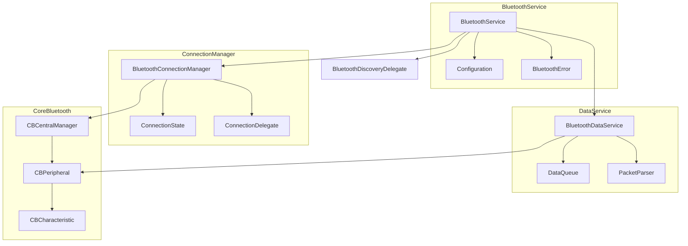
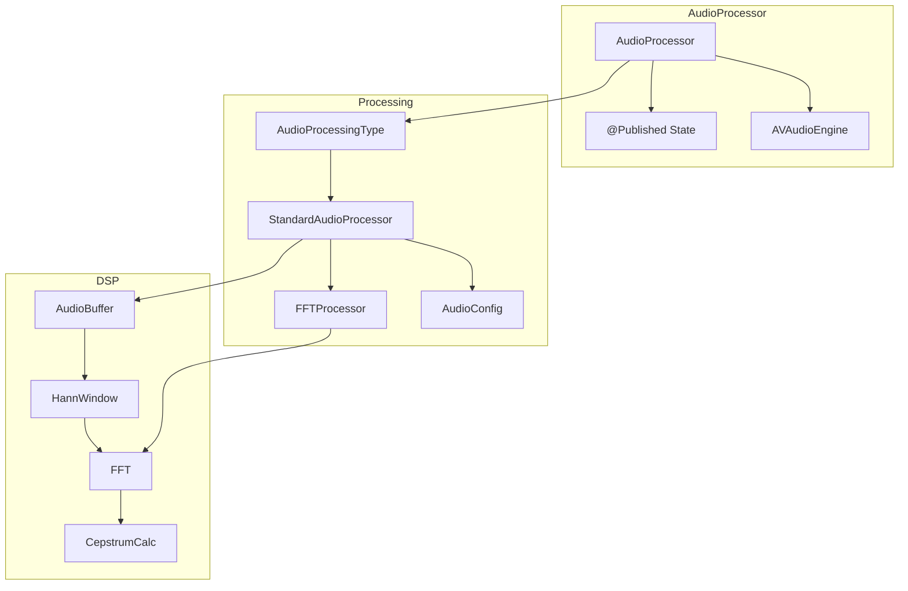
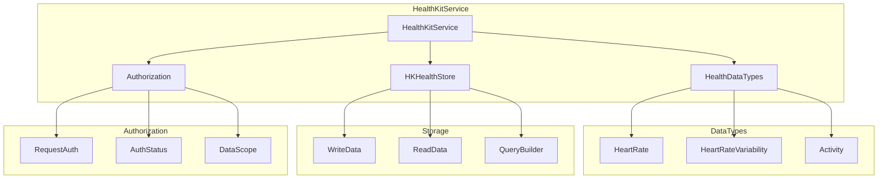
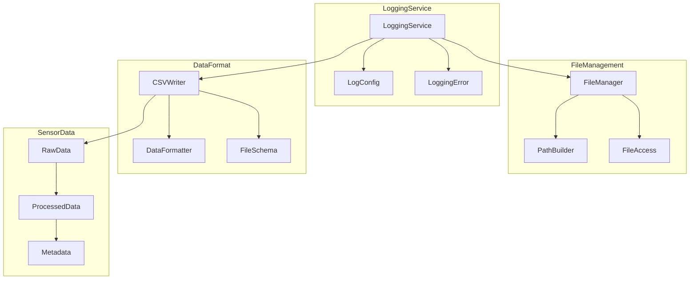
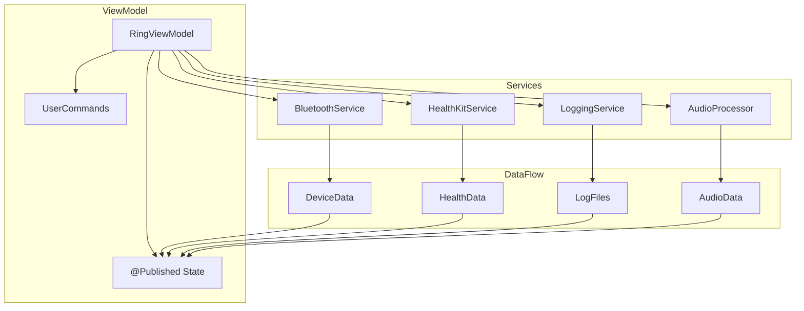

# Services Architecture

This document outlines the core services used in the Halo app.

## Bluetooth Stack

The Bluetooth stack handles device communication and data transfer.

### Key Components:
- **BluetoothService**:
  - Main facade for Bluetooth operations
  - Handles configuration and error management
  - Coordinates between connection and data services
  
- **BluetoothConnectionManager**:
  - Manages device connection states
  - Handles connection/disconnection logic
  - Delegates connection events
  
- **BluetoothDataService**:
  - Manages data transfer queue
  - Handles packet parsing and validation
  - Processes incoming sensor data

## Audio Processing Stack

The audio processing pipeline handles real-time audio analysis.

### Key Components:
- **AudioProcessor**:
  - Manages audio capture and processing state
  - Coordinates with AVAudioEngine
  - Publishes processed results
  
- **StandardAudioProcessor**:
  - Implements core DSP algorithms
  - Configures processing parameters
  - Manages FFT operations

## Health Services

Health data management and storage services.

### Key Components:
- **HealthKitService**:
  - Manages HealthKit interactions
  - Handles data type configuration
  - Coordinates authorization flow
  
- **Authorization**:
  - Manages permission requests
  - Tracks authorization status
  - Defines data access scope

## Logging Service

Handles data logging and file management.

### Key Components:
- **LoggingService**:
  - Manages logging configuration
  - Handles error conditions
  - Coordinates file operations
  
- **FileManagement**:
  - Manages file system operations
  - Builds file paths
  - Controls file access

## Service Dependencies

## Error Handling

Each service implements its own error type with specific error cases:

- **BluetoothError**:
  - Connection failures
  - Data transmission errors
  - Device discovery issues
  
- **HaloError**:
  - Service configuration errors
  - Resource access failures
  - State validation errors
  
- **LoggingError**:
  - File system errors
  - Data formatting issues
  - Storage capacity problems

## Configuration

Services can be configured through their respective configuration objects:

- **AudioProcessingConfig**:
  - Window size and type
  - Sample rate
  - Processing parameters
  
- **BluetoothServiceConfiguration**:
  - Service UUIDs
  - Connection timeouts
  - Retry policies

## Testing

Each service has corresponding test files in the HaloTests directory:
- BluetoothServiceTests
- HealthKitServiceTests
- LoggingServiceTests
- AudioProcessingTests
